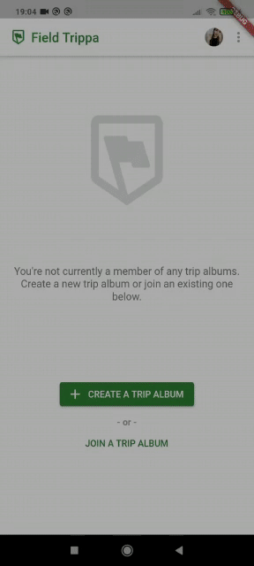
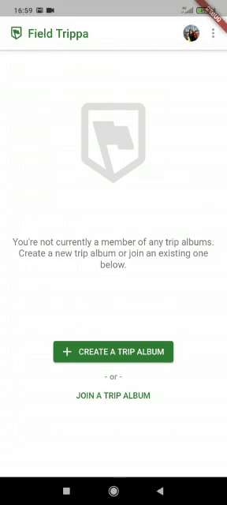

# Google Photos Library API Sharing Codelab

References:
- https://codelabs.developers.google.com/codelabs/google-photos-sharing/#0
- https://github.com/googlecodelabs/photos-sharing/tree/main

<table>
  <tr>
    <td>Article List Page</td>
     <td>Article Details</td>
  </tr>
  <tr>
    <td></td>
    <td></td>
  </tr>
 </table>
